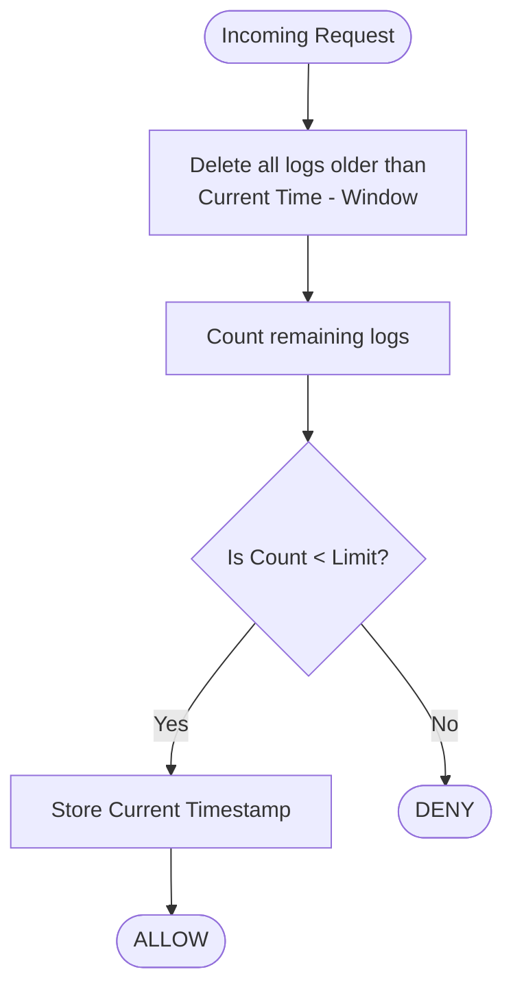
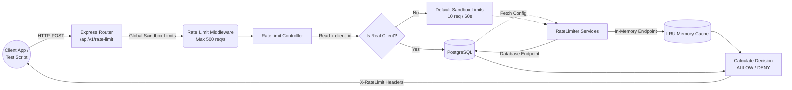
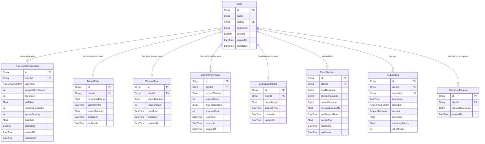

# LimitLab

<p align="left">
  
  
  
  
  
</p>

A high-performance, real-time sandbox and playground for visualizing and load-testing 5 fully-functional rate-limiting algorithms.

## Overview
LimitLab is an interactive, highly visual platform designed to demystify API Rate Limiting. It allows engineers to configure, simulate, visualize, and compare five distinct rate-limiting algorithms in real-time. Whether you want to test how a **Token Bucket** responds to burst traffic, visualize how a **Leaky Bucket** queues excess requests, or download localized load-testing scripts for your own applications, LimitLab provides a zero-latency playground backed by both **In-Memory** (LRU cache) and **PostgreSQL** architectures.

## Features
- **Zero-Latency Sandbox:** Test rate limits instantly with in-memory LRU caches that dynamically sync with your configurations.
- **Algorithm Playground:** Deep-dive into 5 distinct rate-limiting strategies with real-time UI synchronization.
- **Visual Simulation Engine:** A deterministic React simulation engine allowing users to visually model behavior using timelines, request graphs, and comparison modes.
- **Dynamic Script Generation:** Download auto-generated load-testing scripts (Node.js, Python, Bash) that securely embed your custom DB configurations and timing constraints.
- **Robust Architecture:** PostgreSQL-backed implementations featuring Optimistic Concurrency Control (OCC) and precision timestamping.
- **Open Public API:** Fully open CORS endpoints designed explicitly for external benchmarking and simulated DDOS traffic testing.

---

## Algorithms Explained

### 1. Token Bucket
A steady stream of tokens is added to a bucket. Requests consume tokens. If the bucket is empty, the request is denied. Ideal for APIs that need a steady baseline but want to allow brief bursts of traffic.


### 2. Fixed Window
Time is divided into absolute intervals (e.g., 12:00:00 to 12:01:00). Requests are counted within that interval. Easy to implement but suffers from "edge spikes" where a user can send double their limit by spanning across a window boundary.


### 3. Sliding Window Counter
A hybrid approach that tracks the current fixed window and the previous fixed window, calculating a weighted average based on how much time has passed in the current window. Smooths out edge spikes without the memory overhead of a log.


### 4. Sliding Log
Tracks the exact timestamp of every single request in a rolling timeframe. The most accurate algorithm possible, but suffers from high memory consumption and processing overhead as every timestamp must be stored and evaluated.



### 5. Leaky Bucket
Incoming requests are placed into a queue. The queue "leaks" (processes requests) at a strictly constant rate. If the queue is full, new requests are dropped. Ideal for strict traffic shaping and protecting downstream services from sudden load spikes.


---

## System Architecture & Data Flow



---

## Database Schema



---

## Project Structure

```text
LimitLab/
├── frontend/
│   ├── src/
│   │   ├── components/         # Reusable UI components (Cards, Badges, Charts)
│   │   │   ├── ui/             # shadcn/ui generic components
│   │   │   └── dashboard/      # Custom dashboard visualizations
│   │   ├── pages/              # Main routing views
│   │   │   ├── ClientDetailsPage.tsx  # Interactive sandbox, script generation, real-time UI sync
│   │   │   ├── DashboardPage.tsx      # Global statistics overview
│   │   │   └── SimulationPage.tsx     # Visual drag-and-drop deterministic simulation
│   │   ├── lib/
│   │   │   └── utils.ts        # Tailwind merge & utility functions
│   │   ├── App.tsx             # React Router configuration
│   │   ├── main.tsx            # React DOM entry point
│   │   └── index.css           # Global Tailwind v4 styles
│   ├── package.json            # React, Vite, Tailwind, Recharts, Framer Motion
│   └── vite.config.ts          # Vite bundler config
│
├── backend/
│   ├── src/
│   │   ├── config/             # Environment and Logger setup
│   │   ├── controllers/        # HTTP Handlers
│   │   │   ├── client.controller.ts
│   │   │   ├── dashboard.controller.ts
│   │   │   └── rateLimit.controller.ts
│   │   ├── routes/             # Express Routers
│   │   │   ├── api.routes.ts
│   │   │   ├── client.routes.ts
│   │   │   ├── dashboard.routes.ts
│   │   │   └── rateLimit.routes.ts    # Global sandbox rate-limit middlewares
│   │   ├── services/           # Core Business Logic & Algorithms
│   │   │   ├── client.service.ts
│   │   │   ├── dashboard.service.ts
│   │   │   ├── tokenBucketRateLimiter.service.ts
│   │   │   ├── inMemoryTokenBucketRateLimiter.service.ts
│   │   │   ├── fixedWindowRateLimiter.service.ts
│   │   │   ├── inMemoryFixedWindowRateLimiter.service.ts
│   │   │   ├── slidingWindowRateLimiter.service.ts
│   │   │   ├── inMemorySlidingWindowRateLimiter.service.ts
│   │   │   ├── slidingLogRateLimiter.service.ts
│   │   │   ├── inMemorySlidingLogRateLimiter.service.ts
│   │   │   ├── leakyBucketRateLimiter.service.ts
│   │   │   └── inMemoryLeakyBucketRateLimiter.service.ts
│   │   └── index.ts            # Express Server & Socket.IO initialization
│   ├── prisma/
│   │   └── schema.prisma       # PostgreSQL Database Models
│   ├── tests/                  # Robust TypeScript Load Testing Suite
│   │   ├── loadTest.ts         # Token Bucket Suite
│   │   ├── fixedWindowLoadTest.ts
│   │   ├── slidingWindowLoadTest.ts
│   │   ├── slidingLogLoadTest.ts
│   │   └── leakyBucketLoadTest.ts
│   ├── package.json            # Node, Express, Prisma, Socket.io
│   └── tsconfig.json           # Backend TS Compiler Options
│
├── README.md                   # You are here!
├── CHANGELOG.md                # Detailed release notes
└── .gitignore
```

---

## Getting Started

### Prerequisites
- Node.js (v18+)
- PostgreSQL Database (Local or Supabase)

### Backend Setup
1. `cd backend`
2. `npm install`
3. Copy `.env.example` to `.env` and set your `DATABASE_URL` and `DIRECT_URL`.
4. `npx prisma generate`
5. `npx prisma db push`
6. `npm run dev`

### Frontend Setup
1. `cd frontend`
2. `npm install`
3. Copy `.env.example` to `.env` and set `VITE_API_URL=http://localhost:3001/api/v1`.
4. `npm run dev`

---
*Built for API Engineers & Architects.*
