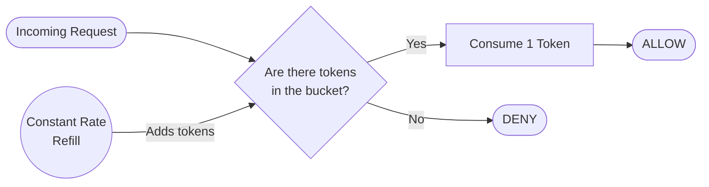
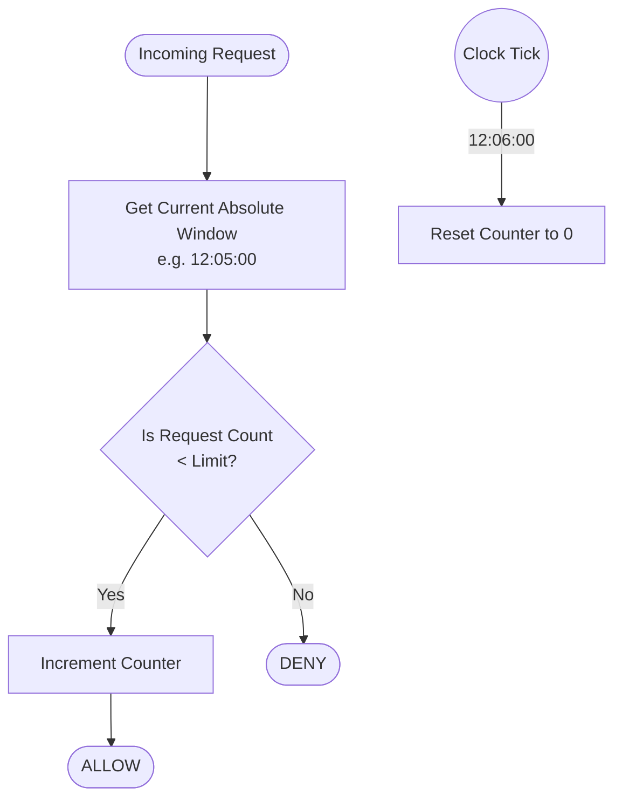
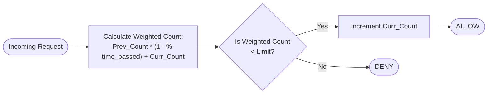
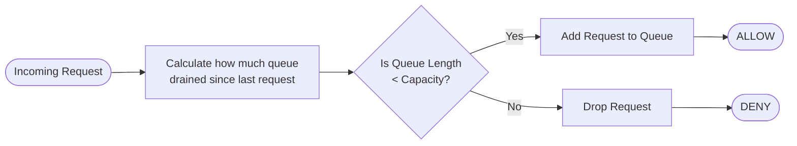
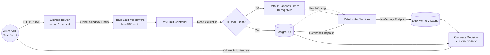
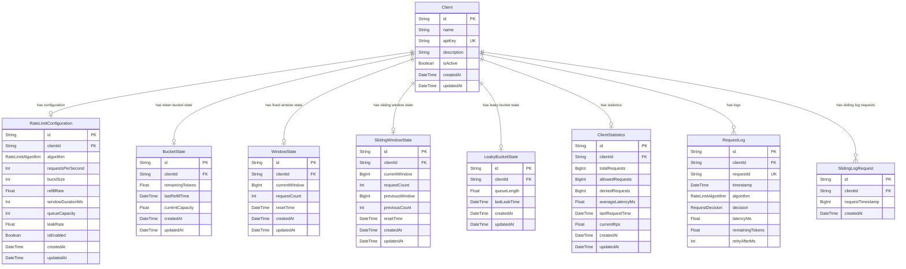

<p align="center">
  
</p>

<h1 align="center">LimitLab</h1>

<h4 align="center">An Interactive API Rate Limiting Sandbox</h4>

<p align="center">
  
  
  
  
  
  
</p>

<p align="center">
  <em>A high-performance, real-time sandbox for visualizing, simulating, and load-testing five fully-functional rate-limiting algorithms with dual In-Memory and PostgreSQL backends.</em>
</p>

---

## Core Capabilities

| | |
|---|---|
| **Zero-Latency Sandbox** | Test rate limits instantly with in-memory LRU caches that dynamically sync with your configurations. No external dependencies needed to start experimenting. |
| **Five Algorithm Playground** | Deep-dive into Token Bucket, Fixed Window, Sliding Window Counter, Sliding Log, and Leaky Bucket with real-time UI synchronization and per-client configurations. |
| **Visual Simulation Engine** | A deterministic, pure client-side React simulation engine with drag-and-drop timelines, live request graphs, playback speed controls, and side-by-side comparison mode. |
| **Dynamic Script Generation** | Download auto-generated load-testing scripts in Node.js, Python, and Bash that securely embed your custom DB configurations and timing constraints. |
| **Dual Architecture** | Every algorithm ships with both an In-Memory (LRU cache) implementation and a PostgreSQL-backed implementation featuring Optimistic Concurrency Control. |
| **Open Public API** | Fully open CORS sandbox endpoints designed explicitly for external benchmarking, with hard rate ceilings (500 req/s burst, 3000 req/15min sustained). |

---

## Algorithms

### 1. Token Bucket
A steady stream of tokens is added to a bucket at a constant rate. Requests consume tokens. If the bucket is empty, the request is denied. Ideal for APIs that need a steady baseline but want to allow brief bursts of traffic.



### 2. Fixed Window
Time is divided into absolute intervals. Requests are counted within that interval. Easy to implement but suffers from edge spikes where a user can send double their limit by spanning across a window boundary.



### 3. Sliding Window Counter
A hybrid approach that tracks the current fixed window and the previous fixed window, calculating a weighted average based on how much time has passed in the current window. Smooths out edge spikes without the memory overhead of a log.



### 4. Sliding Log
Tracks the exact timestamp of every single request in a rolling timeframe. The most accurate algorithm possible, but suffers from high memory consumption and processing overhead as every timestamp must be stored and evaluated.


### 5. Leaky Bucket
Incoming requests are placed into a queue. The queue leaks (processes requests) at a strictly constant rate. If the queue is full, new requests are dropped. Ideal for strict traffic shaping and protecting downstream services from sudden load spikes.



---

## System Architecture



---

## Database Schema



---

## Project Structure

```text
LimitLab/
├── frontend/
│   ├── src/
│   │   ├── components/         # Reusable UI components (Cards, Badges, Charts)
│   │   │   ├── ui/             # shadcn/ui generic components
│   │   │   └── dashboard/      # Custom dashboard visualizations
│   │   ├── pages/              # Main routing views
│   │   │   ├── ClientDetailsPage.tsx  # Interactive sandbox, script generation, real-time UI sync
│   │   │   ├── DashboardPage.tsx      # Global statistics overview
│   │   │   └── SimulatorPage.tsx      # Visual drag-and-drop deterministic simulation
│   │   ├── simulation/         # Pure client-side simulation engine
│   │   │   ├── simulationEngine.ts    # Core deterministic engine
│   │   │   ├── algorithms/            # Per-algorithm simulator implementations
│   │   │   ├── hooks/                 # React hooks for engine integration
│   │   │   └── components/            # Simulator-specific UI components
│   │   ├── lib/
│   │   │   └── utils.ts        # Tailwind merge & utility functions
│   │   ├── App.tsx             # React Router configuration
│   │   ├── main.tsx            # React DOM entry point
│   │   └── index.css           # Global Tailwind v4 styles
│   ├── package.json
│   └── vite.config.ts
│
├── backend/
│   ├── src/
│   │   ├── config/             # Environment and Logger setup
│   │   ├── controllers/        # HTTP Handlers
│   │   ├── middleware/         # Admin authentication middleware
│   │   ├── routes/             # Express Routers
│   │   └── services/           # Core Business Logic & Algorithm Implementations
│   ├── prisma/
│   │   └── schema.prisma       # PostgreSQL Database Models
│   ├── tests/                  # TypeScript Load Testing Suite
│   ├── package.json
│   └── tsconfig.json
│
├── .github/
│   └── workflows/
│       └── ci.yml              # Automated lint & build checks
│
└── README.md
```

---

## Getting Started

### Prerequisites
- Node.js (v20+)
- PostgreSQL Database (Local or Supabase)

### Backend Setup
```bash
cd backend
npm install
cp .env.example .env          # Set DATABASE_URL and DIRECT_URL
npx prisma generate
npx prisma db push
npm run dev
```

### Frontend Setup
```bash
cd frontend
npm install
cp .env.example .env          # Set VITE_API_URL=http://localhost:3001/api/v1
npm run dev
```

---

## API Endpoint Security

| Endpoint Group | CORS | Rate Limit | Auth |
|---|---|---|---|
| `/health` | Open | None | None |
| `/api/v1/clients` | Strict (Vercel origin only) | 100 req / 15 min | Admin Key for create/delete |
| `/api/v1/stats/dashboard` | Strict (Vercel origin only) | 100 req / 15 min | None |
| `/api/v1/rate-limit/*` | Open (sandbox) | 500 req/s burst + 3000 req/15min sustained | None |

---

## Tech Stack

| Layer | Technology |
|---|---|
| Frontend | React 19, Vite, Tailwind CSS v4, Recharts, Framer Motion |
| Backend | Node.js, Express.js, TypeScript |
| ORM | Prisma 6 |
| Database | PostgreSQL (Supabase) |
| Deployment | Vercel (Frontend), AWS EC2 + Nginx + PM2 (Backend) |
| CI/CD | GitHub Actions |

---

<p align="center"><em>Built for API Engineers and Architects.</em></p>
